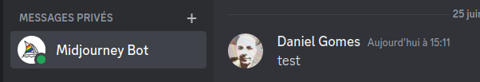
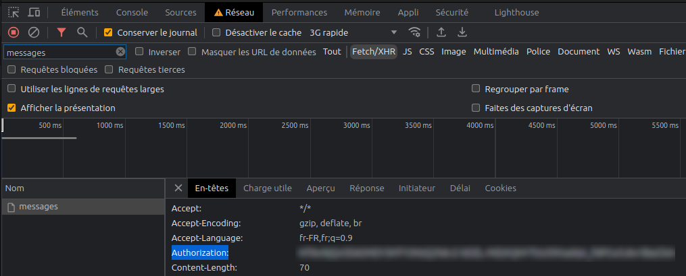
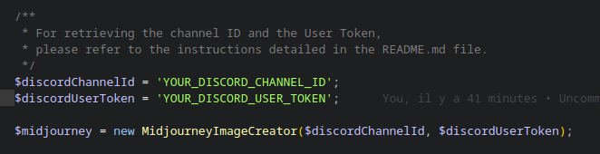
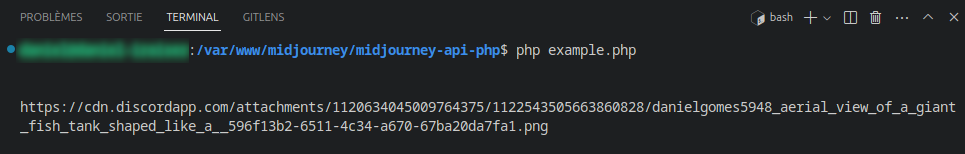

# Utilize the Discord API to generate images with the Midjourney Bot.

This PHP library offers a user-friendly interface for creating images with the Midjourney Bot, leveraging the capabilities of the Discord API.

This version has the capability to incorporate example **images via URLs** into the Midjourney prompts, providing full compatibility with both **private and public channels**.

This version was inspired by the following package: https://github.com/ferranfg/midjourney-discord-api-php. After many hours of work, the project now fulfills all the needs that were not met by this initial version.
<br /><br />

## Installation

You can seamlessly integrate this library into your project using Composer. To do so, execute the following command in your project's root directory:

`composer require batdan/midjourney-php`
<br /><br />

## Usage

### Fundamental Usage Instructions

To generate an image with the Midjourney Bot, initiate an instance of the Midjourney class:

```php
use vw\ai\MidjourneyImageCreator;

$midjourneyImageCreator = new MidjourneyImageCreator($discord_channel_id, $discord_user_token);

// Example of a prompt
$prompt = <<<EOF
aerial view of a giant fish tank shaped like a tower in the middle of new york city, https://depuismonhamac.jardiland.com/wp-content/uploads/2019/06/AdobeStock_196378179.jpeg, 8k octane render, photorealistic --ar 9:20 --v 5
EOF;


/**
 * The imageCreation method is responsible for randomly selecting an image from the 4 options provided by Midjourney.
 * If you want to specify a particular image, you can pass its identifier (ranging from 0 to 3) as the second parameter.
 * 
 * Example: $midjourneyImageCreator->imageCreation($prompt, 0);
 *
 * This will generate an image for the given prompt, using the specified image identifier (in this case, 0).
 */
$message = $midjourneyImageCreator->imageCreation($prompt);

return $message->upscaled_photo_url;
```
<br />

### Constructor

- `$discordChannelId`:
    - Substitute this value with the Channel ID where the Midjourney Bot has been installed. The Channel ID can be obtained by right-clicking on the channel and **selecting Copy Channel ID**.
    - Keep in mind that you can invite the Midjourney Bot to your own server to better organize your work. For more information, refer to https://docs.midjourney.com/docs/invite-the-bot
<br /><br />
- `$discordUserToken`:
    - To retrieve your Discord User Token, you will need to use the Developer Tools in your browser and look into the network data. Here are the steps:

        - Open Discord in your browser (not the app).
        - Open the Developer Tools (you can typically open this by pressing F12 or Ctrl + Shift + I on Windows/Linux or Cmd + Option + I on MacOS).
        - Navigate to the **"Network"** tab.
        - In the filter box, type **"messages"** to narrow down the list of network requests.
        - Send a message in any Discord channel.
        <br /><br />
        
        <br /><br />
        - Look at the network requests that pop up after sending the message, select the one that has **"messages"** in its name.
        - Within the Headers tab, look for the request header named "Authorization". The value of this header **is your User Token**.
        <br /><br />
        
        <br /><br />

    **Important Note:** Keep your User Token strictly confidential. Anyone who has your token can take control of your Discord account. Never share it with anyone and don't publish it online. If you think your token may have been compromised, change your password immediately as this will cause your current token to become invalid.
<br /><br />

## Optimal Performance: Consider Using the CLI Script
To ensure optimal performance and avoid any potential execution time issues, we recommend utilizing the CLI (Command Line Interface) script for your task. The CLI script provides a streamlined and efficient environment, allowing for faster processing and smoother execution.
<br /><br />

Before running the script, please fill in the **Channel ID* and **User Token** in the **example.php** file:
<br />

<br /><br />

<br /><br />

Automatically Generated Image:
<br /><br />

<br /><br />
